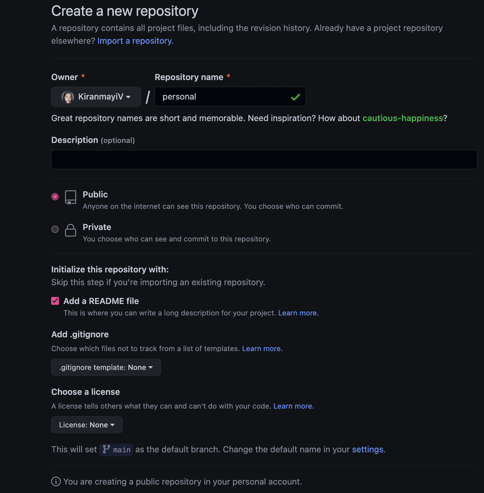
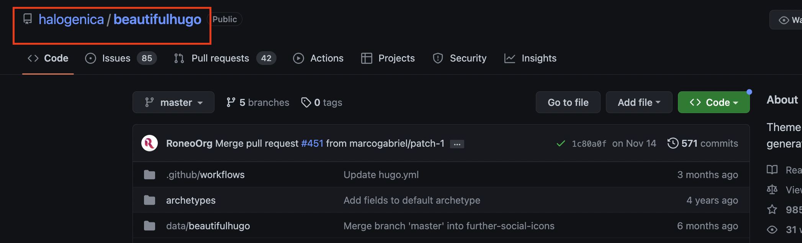

<!---
bigimg: [{src: "featured-hugo.png", desc: "Beautiful Hugo Theme"}] 

**updated: 2022-12-31**
[Getting Started](#Getting-Started)
- [Choice of Hugo Theme](#Choice-of-Hugo-theme)

[GitHub, Blogdown and Hugo](#GitHub,Blogdown-and-Hugo)
- [Creating a GitHub Repo](#Creating-a-GitHub-Repo)
- [Create a R project synced to the GitHub Repo](#Create-a-R-project-synced-to-the-GitHub-Repo)
- [Create a site by pulling the theme files into R Project](#Create-a-site-by-pulling-the-theme-files-into-R-Project)

[Customising theme & content](#Customising-theme-&-content)
- [Config file](#Config-file)
- [Customising styles](#Customising-styles)
- [Creating a new post](#Creating-a-new-post)

[Deploying on Netlify](#Deploying-on-Netlify)
- [Pushing to GitHub](#Pushing-to-GitHub)
- [Creating .gitignore](#Creating-.gitignore)
- [Creating netlify.toml](#Creating-netlify.toml)
- [Hosting your website](#Hosting-your-website)

[Resources](#Resources)

--->
 

After several years trials and errors of building my website with wix, notion, jekyll-git pages, I have decided to give R blogdown-Hugo a try. The search for the right combination of tools that help you write and execute your code, produce dynamic visualizations and embed widgets is like searching for liquid gold. Nevertheless so far R blogdown-Hugo has been the most seamless way of building and pushing content to a website without having to learn too much of HTML and CSS.

I must add that if you have ever build shiny apps or make D3 visuals you will most likely be better equipped to undertand and perhaps customise the styling of your Hugo website. That being said the target users who will mostly likely use this method of building a personal website - would be R users, data analysts, scientists and academics. If you are a developer chances are you would prefer to build your own website the traditional way. 

### Getting Started ----

This brings me to the helpful pre-requisites that could make things easier to debug if something were to go wrong:
- Basic understanding of R
- most recent version of [R-studio](https://posit.co/downloads/) and [R](https://cran.r-project.org/bin/windows/base/)
- a [Netlify account](https://www.netlify.com/?utm_source=google&utm_medium=paid_search&utm_campaign=12755510784&adgroup=118788138897&utm_term=netlify&utm_content=aud-1301837157783:kwd-371509120223&creative=514583565825&device=c&matchtype=e&location=9071851&gclid=CjwKCAiAzKqdBhAnEiwAePEjkgdFFE5dBjwl34gAK3PT-qECaOVZuhndO0RwvioVEqIOi_7mnSrH-hoCgK0QAvD_BwE) to host your final website
- [GitHub account](https://github.com/) and basic understanding of how version control with GitHub works

#### Choice of Hugo theme

While there are more than 300 Hugo themes to choose from, unfortunately the choice of Hugo theme does play a role when building with blogdown as not all are compatible or have been tested for compatability. A few Hugo themes that have been tested are [Lithium](https://github.com/yihui/hugo-lithium), [Apero](https://github.com/hugo-apero/hugo-apero-docs), [Wowchemy](https://github.com/wowchemy/wowchemy-hugo-themes) and you can find a list of more [here](https://bookdown.org/yihui/blogdown/other-themes.html#choosing-themes).
A theme with decent documentation and several users is usually easier to debug to test it with blogdown. I use [Beautiful Hugo](https://github.com/halogenica/beautifulhugo) for building my website.

### GitHub, Blogdown and Hugo

 #### Creating a GitHub Repo
 
The first step is to head to GitHub and create a new repository with a name of your choice. Also add a readme and don't add a .gitignore file. You would now need to click on code on the top right of your new repository and copy the https URL.



#### Create a R project synced to the GitHub Repo

The next step is to head to R Studio and create a project. 

Click on File > New Project > Version Control > Git and paste the URL copied from the previous step, set the location of the project and click on create project. This assigns the your newly created repo to the project and any changes made in your R project session can then be pushed to this Git repo.

#### Create a site by pulling the theme files into R Project

After this, you would need to bring in your theme files into your R project session.

You can simply run the following to install and use blogdown and then use the new_site function to build a new site that pulls in your theme files - in this case I use Beautiful Hugo.

```
install.packages("blogdown")
library(blogdown)

blogdown::new_site(theme = "halogenica/beautifulhugo")
```
I copied the GitHub repository that points to the Hugo Theme and used in the new_site function above.



At this stage you will have a basic folder structure in your local computer (in the same location you chose to create your project) of the theme files and it should look something like this:


Serve your site locally to view how it looks. This will also help in seeing any changes you make to the site in real-time in the Viewer tab.

```
blogdown::serve_site()
```
You should now see the site hosted locally on the Viewer tab in R Studio.

### Customising theme & content ----
This part can get really long (depending on your inclination) and perhaps is the most time consuming. For the sake of brevity and perhaps also the larger purpose of this article i.e. to get a website up and running quickly, I will just mention the basics giving references to where you can find more details.

#### Config file
The config(.toml or .yaml) file is the main file that holds the key to customizing your theme. 
In this file you can change several parameters and values to make the site more like your website and less like the theme's demo website.
Here are the changes I made -
- title
- homeTitle
- subtitles
- logo
- favicon
- name
- email and other socials


You can also add disqus, Google Analytics and enable other features depending on what your theme offers.
These changes will instantly revamp your site with your details.

The logo, favicon and bigimg (if enabled) should be placed in the static folder. The bigimg is the image you see on the top of the page in the background of the homeTitle and subtitle. 

On my website it would be the image of the beach you see on the front page which is a bigimg. 


It is possible to have a *bigimg* for individual posts as well by specifying it in your markdown file at the top as a *bigimg*. You can also add a featured image that features on your blogpost on the landing page of your website.

```
title: Building a Hugo website with R blogdown and netlify
author: Kiran
date: '2022-12-28'
slug: []
categories: []
tags: []
type: ''
subtitle: 'Without any CSS and HTML'
image: 'featured-hugo.png'
bigimg: [{src: "featured-hugo.png", desc: "Beautiful Hugo Theme"}] 
```

#### Customising styles

Another aspect of customizing your website could be potentially to change the appearance and styles. This is where knowing CSS/HTML comes handy but its definitely not hard to figure out how to change a few things to your liking. Here's what I did and you can do too - head to themes > beautifulhugo > static > CSS > main.css and figure out the classes of objects you would like to customize. In my case it was ```.navbar``` that I wanted to change the color for. 
Once you have the class head back to your site's local folders > layouts > partials > head_custom.html for customizing objects just before the ```</head>``` in the HTML file of the site or foot_custom.html for customizing objects before the ```</body>``` - end of body tag. To change the navbar color I added the following piece of code to head_custom.html using the css class I found earlier.

```
<style>
.navbar-custom {
  background: #F0FFFF;
  border-bottom: 1px solid #F0FFFF;
}
</style>
```

Updating the head_custom.html or foot_custom.html is purely optional and there is no end to which css class you can customise. All you would need is to explore the themes > beautifulhugo > static > CSS folder to find the right css file and class you would like to change.
Files kept under layout > partials overwrite the default appaearance of your theme.

#### Creating a new post

There seem to several ways of creating a new post.

- One of them is to use the blogdown's inbuilt function to directly create a broiler plate markdown post as a folder under content > post.
```
blogdown::new_post('new-blog.md')
```

- The second is to create a R Markdown file and knit to .md under content > post.
- The third seems to be create a .Rmd file and knit to .html.

Admittedly I have only tried the first method so far and not the other two, but I would reference this [excellent blog](https://www.apreshill.com/blog/2020-12-new-year-new-blogdown/#step-4-create-content) by Alison Hill for trying the second and third option.

### Deploying on Netlify ----

The next part is to host your website so that you can show it off to everyone.

#### Pushing to GitHub

Once you have made all the changes you want to make and customised your website (hopefully to your satisfaction) you can go ahead and push the changes from your R project to it's synced GitHub repo.
Simply head to the terminal tab next to the console tab on your r studio and run the following commands -
```
git add * # or name of the particular file you want to stage
git commit -m comment #replace comment with your commit comments
gitt push
```
This will push the changes from your local folder to your GitHub repo created earlier. You can head to GitHub and check if you can see the latest commits. 

#### Creating .gitignore

Since we chose to not create a .gitignore file while creating our repo we create one now. 

```
file.edit(.gitignore)

```
This step was pretty straightforward and I added the following files to .gitignore.
```
.Rproj.user
.Rhistory
.RData
.Ruserdata
.DS_Store
Thumbs.db
.hugo_build.lock
/public/
/resources/
```
Once created make sure to run a check the file. This will suggest any more files that can be added - a useful feature!

```
blogdown::check_gitignore()
```
#### Creating netlify.toml

The purpose of this file to set the parameters and environment for netlify to deploy. You can create one by - 

```
blogdown::config_netlify()
```
This creates if not already existing a file like this containing details useful for netlify.


#### Hosting your website

The last part is to head to [Netlify](https://www.netlify.com/?utm_source=google&utm_medium=paid_search&utm_campaign=12755510784&adgroup=118788138897&utm_term=netlify&utm_content=kwd-371509120223&creative=514583565825&device=c&matchtype=e&location=9071851&gclid=Cj0KCQiAtbqdBhDvARIsAGYnXBNcVz3Ao8sRUV8Wprb39HezzH3OOYx_Ph06QiCz2JsUzByYx4s7_x0aAqotEALw_wcB) 

- Create or log into your account
- Click on new site and import an existing project

- Connect to GitHub
- Pick the repository from GitHub which has the site files from the previous steps.

- Since we already created a netlify.toml file earlier with the site settings for Netlify, we don't need to make any changes at this step of site settings.

- Click on deploy site.
- Once the site is build and deployed you can head to site settings and change your domain name to something like xxxxx.netlify.app.
- The final step is crucial as it tells the hosted website where each of you site files are located in the GitHub repo and the relation between the pages. Copy your website url which would be something like *https://xxxxx.netlify.app/* and paste it in your config.toml as baseurl. 
- Finally stage and push this most recent change to the config file to GitHub and refresh your netlify website and voila! You should have sucessfully hosted your website.

### Resources -----
1. [Creating Websites with R Markdown](https://bookdown.org/yihui/blogdown/)
2. [Up & running with blogdown in 2021 by Allison Hill](https://www.apreshill.com/blog/2020-12-new-year-new-blogdown/#welcome)
3. [Setting up this website by Monica Thieu](https://www.monicathieu.com/posts/2020-08-10-setting-up-this-website/)
4. [Blogging with Hugo by Justin James](https://digitaldrummerj.me/series/blogging-with-hugo/)
